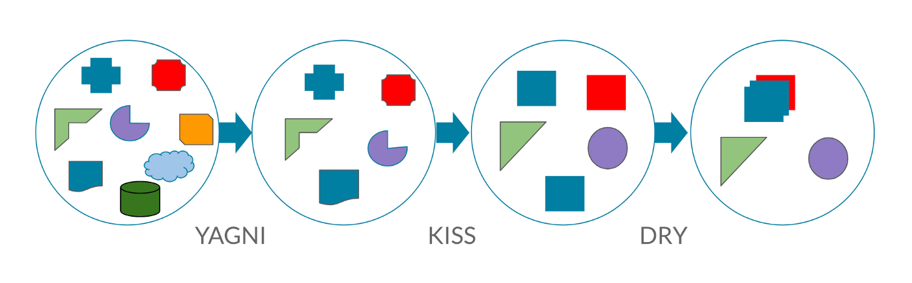

# DRY / KISS / YAGNI

## DRY



Example:

```js
const sortStrings = (arr, direction = 'asc') => {
  if (direction === 'asc') {
    return [...arr].sort((firstStr, secondStr) => {
      return firstStr.localeCompare(secondStr, ['ru', 'en'], {caseFirst: 'upper'});
    })
  } else {
    return [...arr].sort((firstStr, secondStr) => {
      return secondStr.localeCompare(firstStr, ['ru', 'en'], {caseFirst: 'upper'});
    })
  }
}
```

Solution #1:
```js
const sortStrings = (arr, direction = 'asc') => {
  const compare = (a, b) => {
    return a.localeCompare(b, ['ru', 'en'], {caseFirst: 'upper'});
  };
  
  return [...arr].sort((firstStr, secondStr) => {
    return direction === 'asc' 
      ? compare(firstStr, secondStr) 
      : compare(secondStr, firstStr);
  });
}
```

Solution #2:

```js
const sortStrings = (arr = [], direction = 'asc') => {
  const directions = {
    asc: 1,
    desc: -1
  };

  const compare = (a, b) => {
    return a.localeCompare(b, ['ru', 'en'], {caseFirst: 'upper'});
  };
  
  return [...arr].sort((firstStr, secondStr) => {
    return directions[direction] * compare(firstStr, secondStr);
  });
}
```


## KISS

### На рівні функції

Example:

```js
const uniq = (arr = []) => {
  const set = new Set();
  const result = [];
  
  for (const item of arr) {
    set.add(item);  
  }

  for (const item of set) {
    result.push(item);
  }
  
  return result;
};
```

Solution:

```js
const uniq = (arr = []) => {
  return [...new Set(arr)];
};
```

### На рівні компонента

## YAGNI

### На рівні функції


### На рівні компонента

```js
class SortableTable {
  constructor (
    config = [], 
    data = [], 
    sortType = ''
  ) {
    this.config = config;
    this.data = data;
    this.sortType = sortType;
  }
  
  render (data) {
    /* some logic here */
  }
  
  async sort (field, order) {
    const sortedData = await this.sortData(field, order);
    
    render(sortedData);
  }
  
  async sortData (field, order) {
    switch (this.sortType) {
      case "client":
        return this.sortOnClient(field, order);
      case "server":
        return await this.sortOnServer(field, order);
      default:
        throw Error(`Error: there is no sorting algorithm for "${this.sortType}"`)
    }
  }
  
  sortOnClient (field, order) {
    // sort locally
  }
  
  sortOnServer (field, order) {
    // make call to server
  }
}
```

```js
// sort-strategies.js
const clientSortStrategy = (field, order, data, sortFn) => {
  const directions = {
    asc: 1,
    desc: -1
  };
  const direction = directions[order];

  const sortedData = [...this.data].sort((a, b) => {
    return direction * column.sort(a, b);
  });

  return callback => {
    callback(sortedData);
  };
};

const serverSortStrategy = (field, order) => {
  const url = new URL('https://api.example.com');

  url.searchParams.set('sort', field);
  url.searchParams.set('order', order);
  
  const promise = fetch(url)
    .then(response => response.json());

  return callback => {
    promise.then(data => {
      callback(data);
    })
  };
};

// sortable-table.js
class SortableTable {
  constructor (
    config = [],
    data = [],
    sortStrategy
  ) {
    this.config = config;
    this.data = data;
    this.sortStrategy = sortStrategy;
  }

  render (data) {
    /* some logic here */
  }

  sort (field, order) {
    const update = this.sortData(field, order);

    update(() => {
      render(sortedData);  
    });
  }

  sortData (field, order) {
    const column = this.config.find(item => item.id === field);

    if (!column.sort) return;

    return this.sortStrategy(field, order, this.data, column.sort);
  }
}
```
