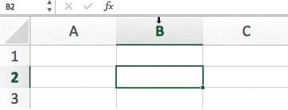

Example: by default there is no reactivity in JavaScript

```js
let message = 'Hello,';
const longMessage = message + ' ' + 'World!';

console.log(longMessage); // 'Hello, World!

message = 'Goodbye,';

console.log(longMessage); // 'Hello, World!
```

Proxy example:

```js
const data = {
  message: 'Hello,',
  longMessage: 'Hello, World!'
};

const handler = {
  set (target, key, value) {
    if (key === 'message') {
      target.longMessage = value + ', World!';
    } 
    
    target.message = value;
  }
};

const proxy = new Proxy(data, handler);
```
