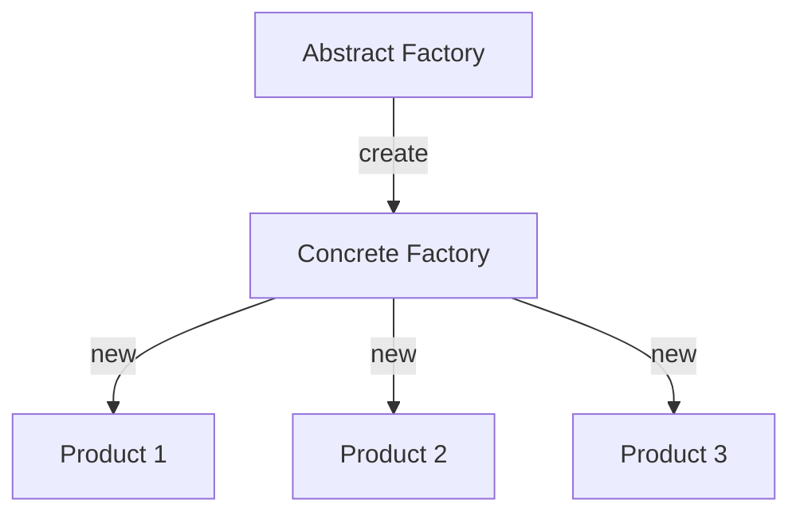

# Abstract Factory



Example:

```js
class SuccessNotification {}

class ErrorNotification {}

class InfoNotification {}

class Component {
  static create (type = '') {
    const notificationTypes = {
      succes: SuccessNotification,
      error: ErrorNotification,
      info: InfoNotification
    };
    
    return notificationTypes[type];
  }
}

const SuccessNotification = Component.create('success');

const success1 = new SuccessNotification();
const success2 = new SuccessNotification();
const success3 = new SuccessNotification();

const ErrorNotification = Component.create('error');

const error1 = new ErrorNotification();
const error1 = new ErrorNotification();
```
