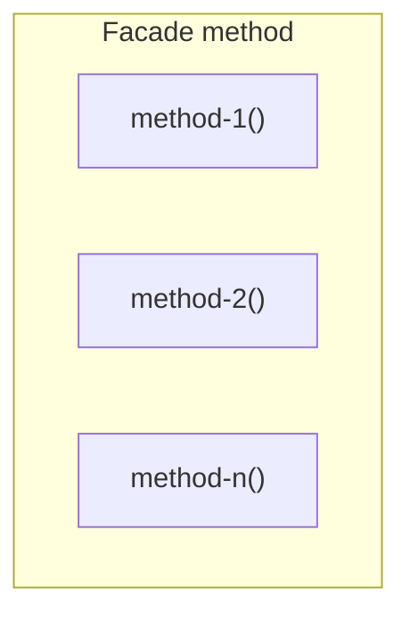

# Facade



Example:

```js
class Component {
  async update () {
    const data = await this.loadData();
    const filteredData = this.filterData(data);
    const sortedData = this.sortData(filteredData);
    
    this.render(sortedData);
  }
  
  async loadData () {/* some implementation */}

  filterData () {/* some implementation */}

  sortData () {/* some implementation */}
}

const component = new Component();

component.update();
```
