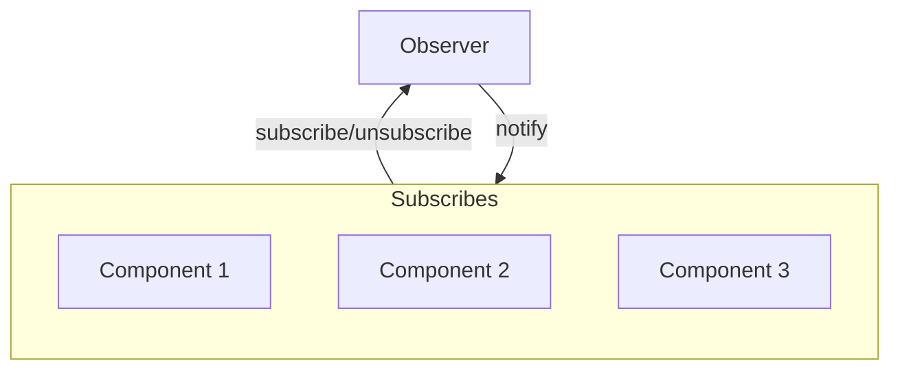

# Observer

```mermaid
flowchart BT
  A[Observer] -- "notify" --> B
  
  B -- "subscribe/unsubscribe" --> A
  
  subgraph B [Subscribes]
    C[Component 1]
    D[Component 2]
    E[Component 3]
  end
```
