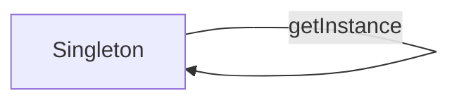

# Singleton



Example:

```js
class Singleton {
  static #instance;

  static get instance() {
    if (Singleton.#instance) {
      return Singleton.#instance;
    }

    return new Singleton();
  }

  constructor() {
    if (Singleton.#instance) {
      return Singleton.#instance;
    }

    Singleton.#instance = this;
  }
} 

new Singleton() === new Singleton(); // true
Singleton.instance() === Singleton.instance(); // true
```
