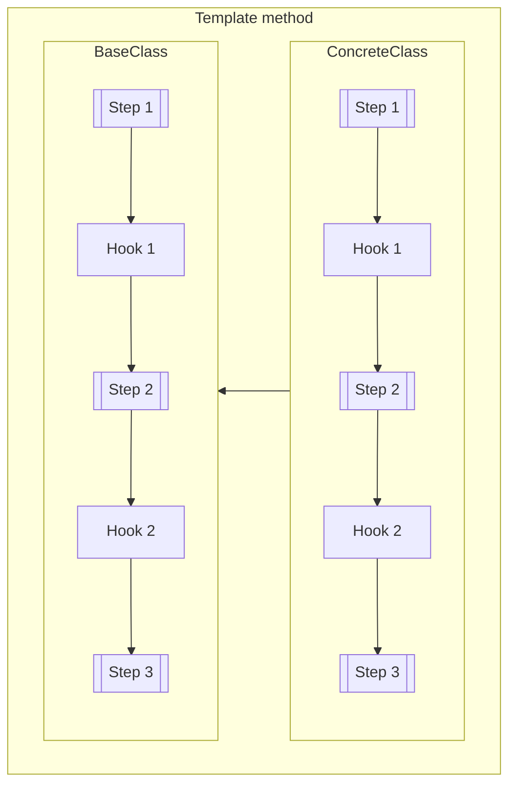

# Template Method



Example:

```js
class BaseComponent {
  constructor() {
    this.templateMethod();
  }

  templateMethod () {
    this.beforeRenderHook();
    this.render();
    this.afterRenderHook();
    this.initEventListeners();
    this.afterInitializationHook();
  }

  beforeRenderHook () {
    // This is hook method
  }

  render () {
    // Some basic implementation
  }

  afterRenderHook () {
    // This is hook method
  }

  initEventListeners () {
    // Some basic implementation
  }

  afterInitializationHook () {
    // This is hook method
  }
}

class Component extends BaseComponent {
  beforeRenderHook () {
    console.log(`This hook will be run before render method`);
  }

  afterRenderHook () {
    console.log(`This hook will be run after render method`);
  }

  initEventListeners () {
    super.initEventListeners();
    // Here we can add extra listeners
  }
}
```
